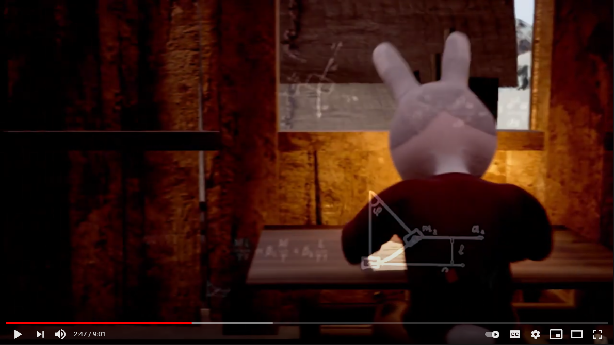
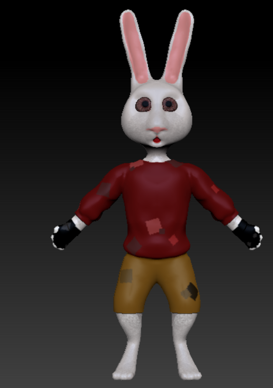
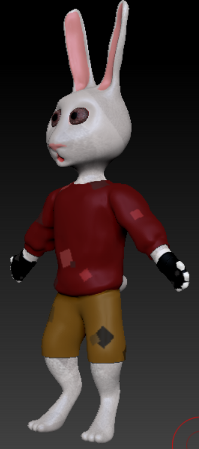
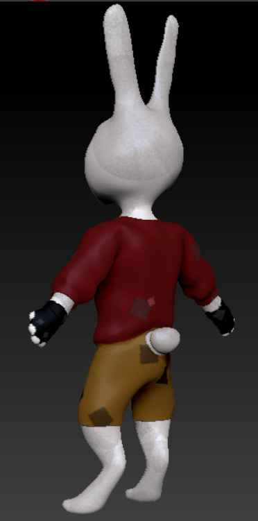
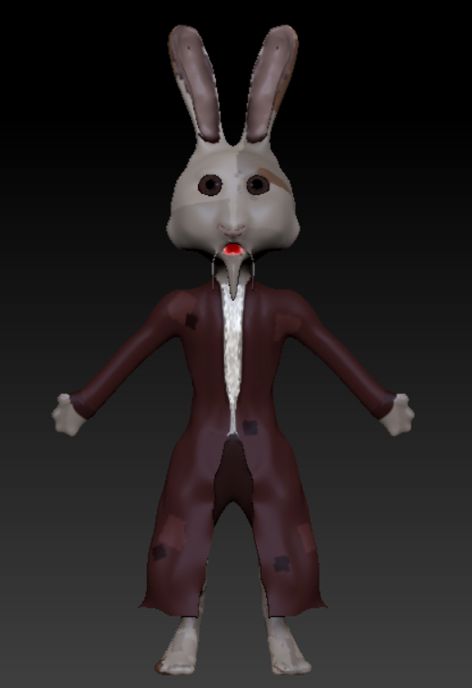
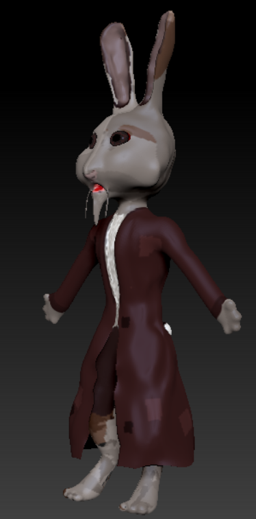
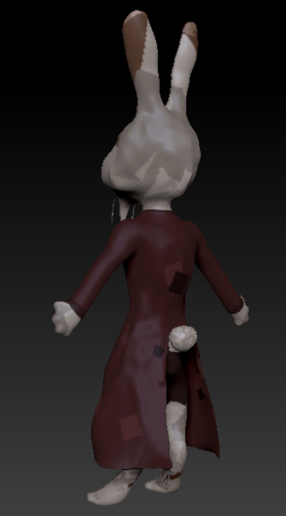

//start with introduction image -- maybe me? Or something relevant

# 3D Character's side hussle

[About Me](index.md) | [Software Engineering skills](Software_Examples.md) 

## Rabbit 180 model
    

## Pappi 180 model
    

Rime of the Ancient Mariner
<a href="https://goatpants.itch.io/rime-of-the-ancient-mariner">Download links here</a>

<object data="GamePlayResume.pdf" type="application/pdf" width="700px" height="700px">
    <embed src="GamePlayResume.pdf">
        
This browser does not support PDFs. Please download the PDF to view it: <a href="GamePlayResume.pdf">Download PDF</a>.

    </embed>
</object>
