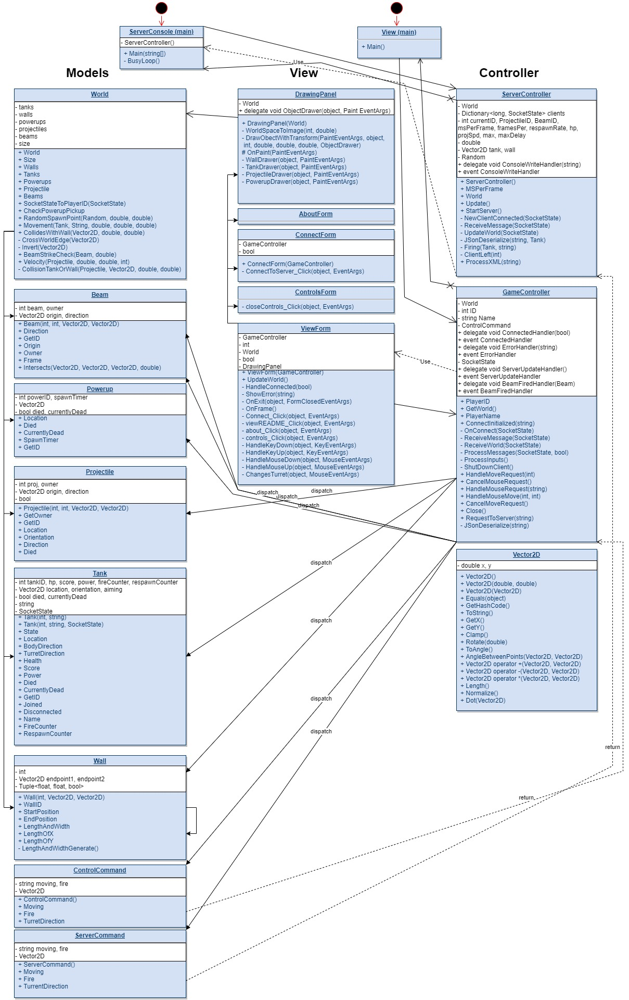

# Software Engineering Experiences

[About Me](index.md) | [3D character modeling side hussle](Art_Experiences.md)

# Most Recent Projects

## Call of Duty Modern Warfare 2, 3, and Mobile
-  Worked as a part of the Online dev team for interfaces that required client and server interactions.
-  Created hooks for UI to interact with, on specific needs without the UI team needing to interact directly with the server code.
-  Monitored in-game voice and user feature bugs.
-  Check my resume below for more details

# Past Projects

## Revenge of the Killer Octopus
- Senior Capstone-related game development. 
-   Creating on a team of 25, with a team of 7 total engineers.
-   Set up with MVC architecture in mind
-   On steam: https://store.steampowered.com/app/1906640/Revenge_of_the_Killer_Octopus/

## Virtual Data-Center Real-time Monitoring
- Fully 3D modeled SLC Downtown Data Center
-   Source Control: Gitlab & external drives
-   Engine: Unreal 4.27
 
- Prometheus queries for real-time metrics
- Self-scripted staging in C++ to gain the most recent data
- Blueprint system to output visual cues based on obtained data.

# Past Projects
## Revenge of the Killer Octopus
- Prototype of Senior Capstone game project
-   Created with a team of 10, with a team of 3 total engineers.
-   Source Control: Perforce
-   Engine: Unreal 4.27
   
   

   
###   Primary responsabilities:
-       Initial health status component creation.
-       On Damage, remove some health percentage.
-       On collision, collect health pack and add to inventory.
-       On key press, use the health pack if it exists in inventory.
-       After a delay in damage, regenerate health (was removed after the design was questioned.)
-       Front-end UI interaction states

## Tank Wars (reimagined)
- For reasons of not showing the code I wrote as an assignment, I've created a diagram instead.

# Projects in Planning

## Twitch streamer additionals
- String light notifications on trigger words
- Viewer interactable with self-animated avatars

## (Mis)Fortune
- Originally created as a board game where the player's end goal is to have more gold than the current reigning monarch.
- Plan to create it multi-networked with a central server to send data, so players can compete with their friends.

<object data="SoftwareEngResume2023.pdf" type="application/pdf" width="700px" height="700px">
    <embed src="SoftwareEngResume2023.pdf">
        
This browser does not support PDFs. Please download the PDF to view it: <a href="SoftwareResume.pdf">Download PDF</a>.

    </embed>
</object>
